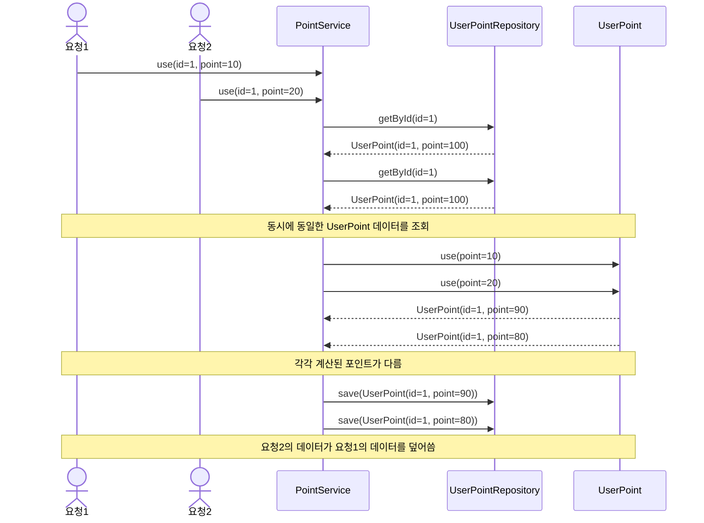
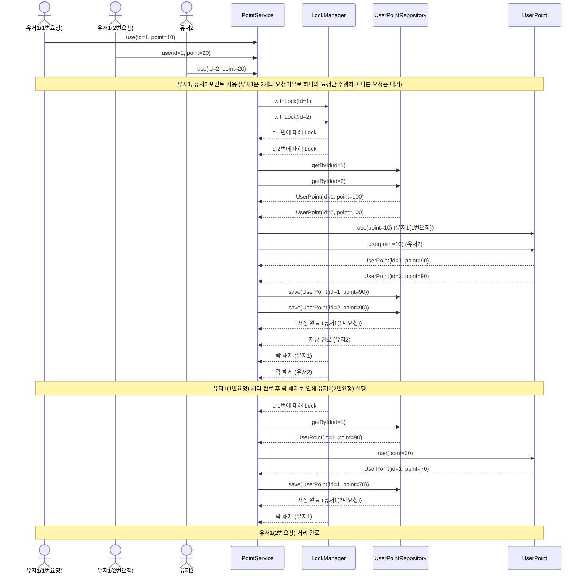
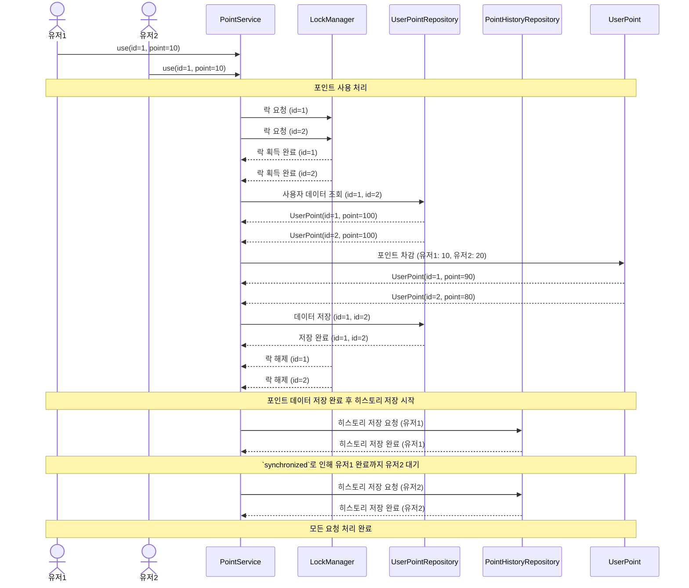

# 동시성 분석 보고서

## 현재 코드에서 동시성 문제가 발생하는 지점
현재 포인트 시스템에서 사용자가 동시에 포인트 사용 요청을 했다고 가정해봅시다.

현재 코드는 다음과 같이 구현된 상태라고 가정해봅시다.
```kotlin
// PointService.kt
    fun use(
        id: Long,
        amount: Long,
    ): UserPoint =
        userPointRepository
            .getById(id)
            .use(amount)
            .let { userPointRepository.save(it) }
            .also { pointHistoryRepository.save(PointHistory.createByUse(it.id, amount)) }

// UserPoint.kt
data class UserPoint(
    val id: Long,
    val point: Long,
    val updateMillis: Long,
) {
    ...
    fun use(amount: Long): UserPoint {
        require(amount > 0) { PointErrorMessage.USE_AMOUNT_SHOULD_BE_POSITIVE.message }
        require(this.point - amount >= 0) { PointErrorMessage.NOT_ENOUGH_POINT.message }
        return UserPoint(id, this.point - amount, this.updateMillis)
    }
    ...
}

```

현재 로직에서는 동시에 요청이 되는 경우 Repository 계층에서 포인트 정보를 읽어오는 과정에서 같은 정보를 읽게 되면서 포인트 사용이 누락될 수 있습니다.

다음 사용 로직을 좀 더 자세하게 살펴보겠습니다.

```kotlin
...
// 동시에 해당 메서드를 동일한 유저가 호출
fun use(
    id: Long,
    amount: Long,
): UserPoint =
    userPointRepository
        .getById(id) // 호출한 시점에 동시에 같은 포인트 정보를 조회
        .use(amount)
        .let { userPointRepository.save(it) } // 같은 정보를 덮어 씌움
        ...
```
위의 주석에 달린 내용과 같이 호출한 시점에 동일한 포인트 정보를 읽어 같은 시점에 포인트를 동시에 사용 처리를 하면 한 건의 요청이 누락되는 문제가 발생할 수 있습니다.

이를 이해하기 쉽게 시퀀스 다이어그램으로 표현하면 다음과 같습니다.


이로 인해 의도한 것과 달리 포인트 사용이 누락되는 문제가 발생할 수 있습니다.

## 동시성 문제
위의 예시에서 설명한 것과 같이 동시에 같은 데이터를 조회하여 사용하는 경우 데이터의 무결성이 깨질 수 있습니다.

이러한 문제는 여러 스레드가 동시에 공유 자원에 접근하면서 발생하는 **경쟁 상태(Race Condition)** 때문입니다.

```markdown
💡 경쟁상태(Race Condition)란, 여러 스레드가 "공유 자원에 동시에 접근하여 실행 순서에 따라 결과가 달라질 수 있는 상황" 을 말합니다.
```

이러한 동시성 문제를 막기 위해서는 동기화 기법이나 Thread-Safe한 자료구조를 사용하여 해결할 수 있습니다.

## 현재 코드에서 동시성 문제를 해결한 방법

현재 요구사항에서 **분산 환경**을 고려하지 않아도 된다는 것을 확인하여 스레드 Lock을 통해 문제를 해결했습니다.

### 포인트 사용 / 충전시에 Lock을 걸어 동시성 문제 해결
포인트 사용 / 충전시에 포인트는 **사용자별로** 관리되기 때문에 사용자별로 Lock을 걸어 동시성 문제를 해결할 수 있습니다.

그래서 특정 키를 통해 Lock을 거는 ReentrantLock을 사용하여 동시성을 제어했습니다.

```kotlin
// LockManager.kt
interface LockManager {
    fun <T> withLock(
        key: Long,
        action: () -> T,
    ): T
}

// ReentrantLockManager.kt
@Component
class ReentrantLockManager(
    private val locks: ConcurrentHashMap<Long, ReentrantLock> = ConcurrentHashMap(),
) : LockManager {
    override fun <T> withLock(
        key: Long,
        action: () -> T,
    ): T {
        val lock = locks.getOrPut(key) { ReentrantLock() }
        lock.lock()
        return try {
            action()
        } finally {
            lock.unlock()
        }
    }
}

// PointService.kt
...
fun use(
    id: Long,
    amount: Long,
): UserPoint =
    lockManager
        .withLock(id) {
            userPointRepository
                .getById(id)
                .use(amount)
                .let { userPointRepository.save(it) }
                .also { pointHistoryRepository.save(PointHistory.createByUse(it.id, amount)) }
        }
```

ReentrantLock의 Key는 `ConcurrentHashMap`을 사용하여 Thread-safe한 자료구조를 활용하고, 락을 관리할 때 동시성 문제가 발생하지 않도록 처리했습니다.

이를 통해 **같은 사용자의 여러 요청이 발생해도 하나의 요청만 실행되며**, 나머지 요청은 락이 해제될 때까지 대기합니다.

Lock을 추가함으로써 다음과 같이 같은 유저인 경우에는 Lock을 걸어 동시성 문제를 해결할 수 있습니다.

### 포인트 히스토리 저장시 Lock을 걸어 동시성 문제 해결

ReentrantLock을 사용하여 포인트 사용 / 충전시에 Lock을 걸어 동시성 문제를 해결했지만 포인트 히스토리의 경우 사용자별 관리가 아닌 하나의 List로 관리하기 때문에 여전히 동시성 문제가 발생할 수 있습니다.

다음 문제로 인해 히스토리가 누락될 수 있습니다.
- 동시에 요청시 cursor가 같은 인덱스를 가르킬 수 있음
- List가 thread-safe한 자료구조가 아니기 때문에 동시성 문제가 발생할 수 있음

이는 현재 데이터를 영속화하는 방식 자체가 문제가 있다고 생각하여 Repository 계층의 문제라고 판단하여 다음과 같이 Repository 계층에서 Syncronized를 걸어 해결했습니다.
```kotlin
// PointHistoryRepository.kt
...
    override fun save(pointHistory: PointHistory): PointHistory {
        synchronized(this) {
            return pointHistoryTable.insert(
                pointHistory.userId,
                pointHistory.amount,
                pointHistory.type,
                pointHistory.timeMillis,
            )
        }
    }
```

위의 로직을 추가함으로써 다음과 같이 동작되도록 변경되었습니다.


## 결론
ReentrantLock과 Syncronized를 사용하여 동시성 문제를 해결했습니다.
